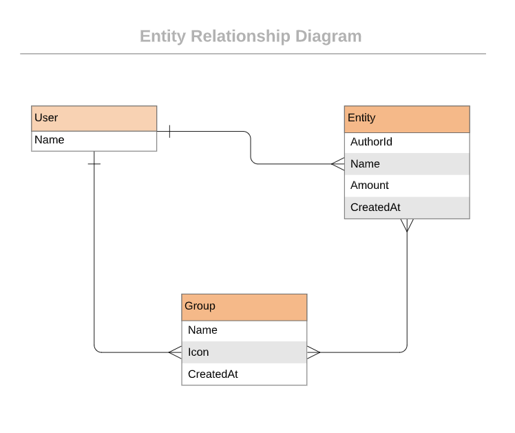

<a name="readme-top"></a>

<div align="center">
  
  <br/>

  <h2><b>Budget App</b></h2>

</div>

<!-- TABLE OF CONTENTS -->

# 📗 Table of Contents

- [📖 About the Project](#about-project)
  - [🛠 Built With](#built-with)
    - [Tech Stack](#tech-stack)
    - [Key Features](#key-features)
  - [🚀 Live Demo & Project Presentation](#live-demo)
- [💻 Getting Started](#getting-started)
  - [Setup](#setup)
  - [Prerequisites](#prerequisites)
  - [Install](#install)
  - [Usage](#usage)
  - [Run tests](#run-tests)
  - [Deployment](#triangular_flag_on_post-deployment)
- [👥 Authors](#authors)
- [🔭 Future Features](#future-features)
- [🤝 Contributing](#contributing)
- [⭐️ Show your support](#support)
- [🙏 Acknowledgements](#acknowledgements)
- [📝 License](#license)

<!-- PROJECT DESCRIPTION -->

# 📖 Budget App <a name="about-project"></a>

**Budget App** The Budget app is a mobile web application where you can manage your budget: you have a list of transactions associated with a category, so that you can see how much money you spent and on what. It allows the user to:

- **register and log in, so that the data is private to them.**
- **introduce new transactions associated with a category.**
- **see the money spent on each category.:**

 <!--  -->

 </br>

## Project requirements

### General requirements

- Make sure that there are [no linter errors](https://github.com/microverseinc/linters-config).
- Make sure that you used correct [Gitflow](https://github.com/microverseinc/curriculum-transversal-skills/blob/main/git-github/articles/gitflow.md).
- Make sure that you documented your work [in a professional way](https://github.com/microverseinc/curriculum-transversal-skills/blob/main/documentation/articles/professional_repo_rules.md).

### Ruby requirements

- Follow our list of [best practices for Ruby](https://github.com/microverseinc/curriculum-ruby/blob/main/articles/ruby_best_practices.md).

## 🛠 Built With <a name="built-with"></a>

### Tech Stack <a name="tech-stack"></a>

<ul>
  <li>Ruby</li>
  <li>Ruby on Rails</li>
  <li>JavaScript</li>
  <li>PostgreSQL</li>
  <li>GitHub</li>
  <li>CSS/SCSS(Bootstrap)</li>
</ul>

<!-- Features -->

### Key Features <a name="key-features"></a>

- [ ] Splash screen:
- A simple page with the name of your app (yes, you need to choose one), and links to the sign up and log in pages.
- [ ] Sign up and log in pages:
- The user should be able to register in the app with full name, email and password (all mandatory).
- The user can log into the app using email and password.
- If the user is not logged in, they can't access pages that require the user to be logged in (all the pages described below).
- [ ] Home page (categories page):
- When the user logs in, they are presented with the categories page.
- For each category, the user can see their name, icon and the total amount of all the transactions that belongs to that category.
- When the user clicks (or taps) on a category item, the application navigates to the transactions page for that category.
- There is a button "add a new category" at the bottom that brings the user to the page to create a new category.
- [ ] Transactions page:
- For a given category, the list of transactions is presented, ordered by the most recent.
- At the top of the page the user could see the total amount for the category (sum of all of the amounts of the transactions in that category).
- There is a button "add a new transaction" at the bottom that brings the user to the page to create a new transaction.
- When the user clicks on the "Back" button (<), the user navigates to the home page.
- [ ] "Add a new category" page:
- The user fills out a form to create a new category, indicating their name and icon (both mandatory).
- The user clicks (or taps) the "Save" button to create the new category, and is taken to the home page on success.
- When the user clicks on the "Back" button (<), the user navigates to the home page.
- [ ] "Add a new transaction" page:
- The user fills out a form to create a new transaction with:
name (mandatory)
amount (mandatory)
categories (mandatory at least one)
- The user click (or taps) the "Save" button to create the new transaction, and is taken to the transactions page for that category.
- When the user clicks on the "Back" button (<), the user navigates to the transactions page for that category.
- [ ] Create unit and integration tests for all the most important components of your RoR application.

<p align="right">(<a href="#readme-top">back to top</a>)</p>

<!-- LIVE DEMO -->

## 🚀 Live Demo <a name="live-demo"></a>

- [Live Demo Link](https://budgetapp-mxoy.onrender.com)

### Video documentation 📹
- [Video presentation by Joseph Ogbole](https://www.loom.com/share/234eeca26cba42008ac4ee1d71752c97)

<p align="right">(<a href="#readme-top">back to top</a>)</p>


<!-- GETTING STARTED -->

## 💻 Getting Started <a name="getting-started"></a>

### Prerequisites

Everything will be based on the ERD class diagram presented below. 

</br>
 <div align="center">
    
    <p>Entity Relationship Diagram (ERD) of Budget App project</p>
</div>

## Getting Started
To run the project locally, copy up and running follow these simple example steps :

 - First of all make sure you have both `Ruby` & `Rails` installed in your machine
 (else You can install `Rails` just with this simple command  ```gem install rails```)
```
$ git clone ### Setup
- Clone this repository to your computer: git clone https://github.com/ONJoseph/BudgetApp.git
```
 - Then go to the right folder 
```
$ cd BudgetApp
```
```
$ bundle
```
and run to install npm package
```
$ npm install
```

make sure the database is up and running.
```
$ rails db:create
```
When you will add migration file then, you can add command like
```
$ rails db:migrate
```
Run this command line to add some dummy data
```
$ rails db:seed
```

 - Finaly run `rails s` and visit http://localhost:3000/  in your browser!

 ## Run tests :

 To run Request specs locally you need just to run this following command in your terminal :

 ```
 $ bundle exec rspec
 ```
 </br>

### Install
- Write: bundle install
- Write: npm install

### Usage
- To test the app:
    - rspec (general)
    - rspec spec/unit/name_of_sile (specific one)

<p align="right">(<a href="#readme-top">back to top</a>)</p>

<!-- AUTHORS -->

## 👥 Author <a name="authors"></a>

👤 **Joseph Ogbole**

- GitHub: [@ONJoseph](https://github.com/ONJoseph)
- Twitter: [@ONJoseph1](https://twitter.com/ONJoseph1)
- LinkedIn: [LinkedIn](https://www.linkedin.com/in/o-n-joseph-ba8425147/)

<p align="right">(<a href="#readme-top">back to top</a>)</p>

<!-- FUTURE FEATURES -->

## 🔭 Future Features <a name="future-features"></a>

- [ ] Integration with financial institutions: The ability to connect to users' bank accounts and automatically import their transactions into the app.
- [ ] Bill reminders: The app can remind users of upcoming bills and help them avoid late fees.
- [ ] Multi-currency support: For users who frequently travel or live in multiple countries, the app could support multiple currencies and provide exchange rate information.
- [ ] Social features: Users can invite friends or family members to join the app and share budgeting goals or expenses with them.

<p align="right">(<a href="#readme-top">back to top</a>)</p>

<!-- CONTRIBUTING -->

## 🤝 Contributing <a name="contributing"></a>

Contributions, issues, and feature requests are welcome!

Feel free to check the [issues page](https://github.com/ONJoseph/BudgetApp/issues).

<p align="right">(<a href="#readme-top">back to top</a>)</p>

<!-- SUPPORT -->

## ⭐️ Show your support <a name="support"></a>

I really enjoyed working on this project. If you like it show your support by giving a star.

<p align="right">(<a href="#readme-top">back to top</a>)</p>

<!-- Acknowledgments -->

## 🙏 Acknowledgments <a name="acknowledgements"></a>

- [Microverse](https://www.microverse.org/) for the motivation.
- Design: Original design idea by (Gregoire Vella on Behance)[https://www.behance.net/gregoirevella]

<p align="right">(<a href="#readme-top">back to top</a>)</p>

<!-- LICENSE -->

## 📝 License <a name="license"></a>

This project is [MIT](https://github.com/ONJoseph/BudgetApp/blob/dev/LICENCE) licensed.

<p align="right">(<a href="#readme-top">back to top</a>)</p>
